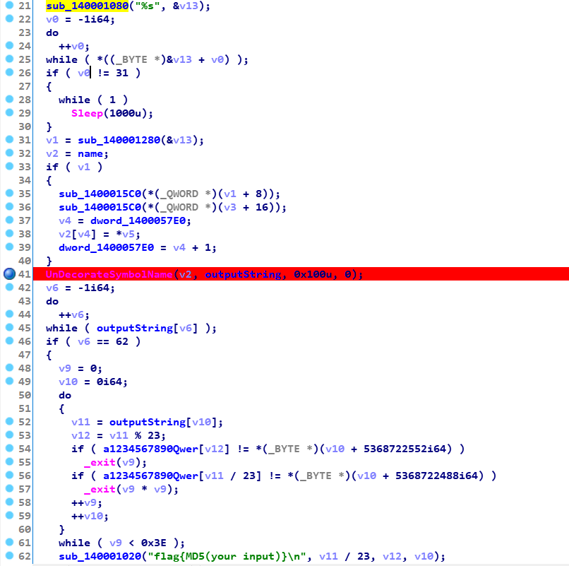
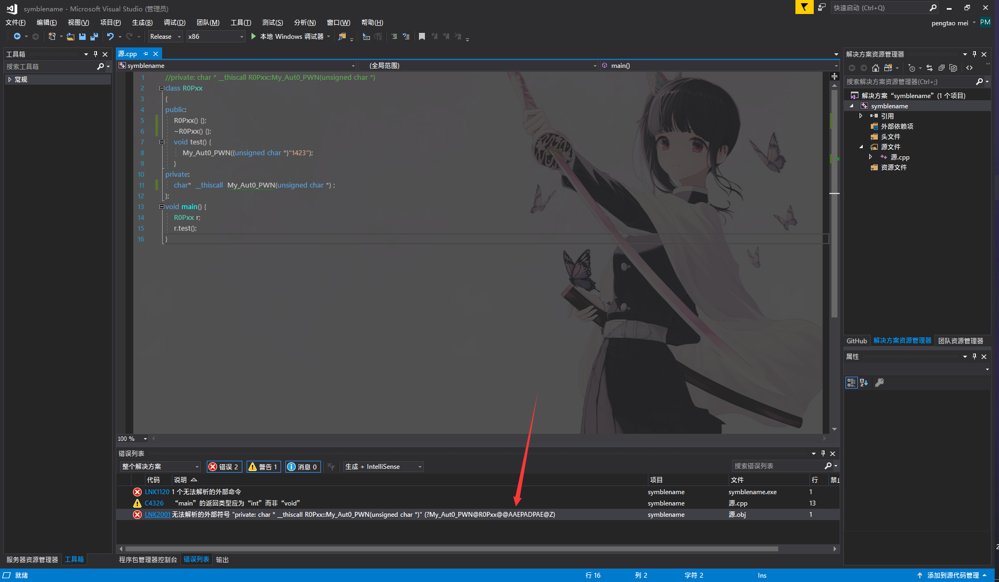

# RedHat_ChildRE WriteUp

## 逆向分析

用ida64分析获得程序主要逻辑

F5获取伪代码<br>
再21行有%s推测是输入函数用v13接收变量，23-25行的代码是获取字符串长度v0是长度,如果v0不等于31就sleep(1000),说明字符串的长度为31。<br>
31-40行的代码是对输入字符串的变换，暂且不知道是怎么变换的，先不用管继续看程序流程。<br>
41行UnDecorateSymbolName(v2, outputString, 0x100u, 0);是个WIN API百度一下<br>
UnDecorateSymbolName 函数反修饰指定已修饰的 C++ 符号名。以下是函数原型
```c
DWORD WINAPI UnDecorateSymbolName(
  _In_ PCTSTR DecoratedName,
  _Out_ PTSTR UnDecoratedName,
  _In_ DWORD UndecoratedLength,
  _In_ DWORD Flags
);
```
根据原型outputString是个输出量，输出是回到用户写代码时的函数名，就是经过编译器生成符号，回到写代码的函数名。<br>
后面就是对outputString的校验了，与输入的字符串无关，输入的字符串在UnDecorateSymbolName()这个函数后就没有关系了。所以我们可以逆向分析出outputString的字符串。

## 算法设计
我们首先获得outputString,然后获得通过一种方式获得编译器产生的符号，在逆出前面的对输入的变换就可以获得flag;

## 算法实现

### 获得outputString
不难发现outputString是每个字节依次校验的，我们可以穷举每个可显示字符，满足要求，从而获得outputString。代码在red_hat.cpp中已给出。获得的名称如下：
```cpp
private: char * __thiscall R0Pxx::My_Aut0_PWN(unsigned char *)
```
解释一下是R0Pxx类下My_Aut0_PWN函数，参数类型为unsigned char *，返回值为char *，调用约定是thiscall。
### 获得对输入的变换
这里我构建一个字符串，并在41行处下断，打开ida调试。
```
输入字符串：0123456789abcdefghijklmnopqrstu
输出字符串：fg7hi83jk9lma41nobpqc5rsdtue620
```
不难发现这里没有一个重复我一次获取改变的位置，放入一个数组记录下标，解密再用这个下标就行了。获取下表函数为red_har.cpp的change1()下标为
```
15,16,7,17,18,8,3,19,20,9,21,22,10,4,1,23,24,11,25,26,12,5,27,28,13,29,30,14,6,2,0
```
### 获得符号
首先我是想找个DecorateSymbolName很可惜没找到这样我就改变想法，让链接器出错，因为链接器出现定位不到符号会显示函数名，这样我就构建这样一个函数。<br>
我们只声明这个函数，然后用类里面的一个函数来调用，这样就会报链接错误。带面如下
```cpp
class R0Pxx
{
public:
	R0Pxx() {};
	~R0Pxx() {};
	void test() {
		My_Aut0_PWN((unsigned char *)"1423");
	}
private:
	char*  __thiscall  My_Aut0_PWN(unsigned char *) ;
};
void main() {
	R0Pxx r;
	r.test();
}
```
这样我们就会得到一个链接错误，从而获得符号。


## 结束
复制符号带入上面的变换函数就能获得key
```
Z0@tRAEyuP@xAAA?M_A0_WNPx@@EPDP
```

今天早上把snake那个题也做了flag{Ch4rp_With_R$@},一个c# unity游戏，用文件搜索软件搜索文件夹搜flag，发现interface.dll有调用。调用GameObject函数<br>
进而发现参数在0-100之间
开多线程并发计算算法如下
```cpp
#include<stdio.h>
#include <Windows.h>
#include<thread>
typedef int(__fastcall *p)(int a);
int code[100];
int index=2;
p fun;
void print_flag() 
{
	int parm=code[index];
	index++;
	fun(parm);
	printf("%d\n", parm);

}
void main() {
	HINSTANCE hDLL = LoadLibrary("Interface.dll");
	fun  = (p)GetProcAddress(hDLL, "GameObject");
	for (size_t i = 0; i < 100; i++)
	{
		code[i] = i;
	}
	//parm <0 skt   100<parm<200 edg  flag 2-100

	//2-10 40-50 70-80 20-30 10-20
	index = 10;
	for (int i = 10; i <20 ; i++)
	{
		std::thread *thread=new std::thread(print_flag);
		thread->detach();
	}
	//flag{Ch4rp_W1th_R$@}
	getchar();
}
```
